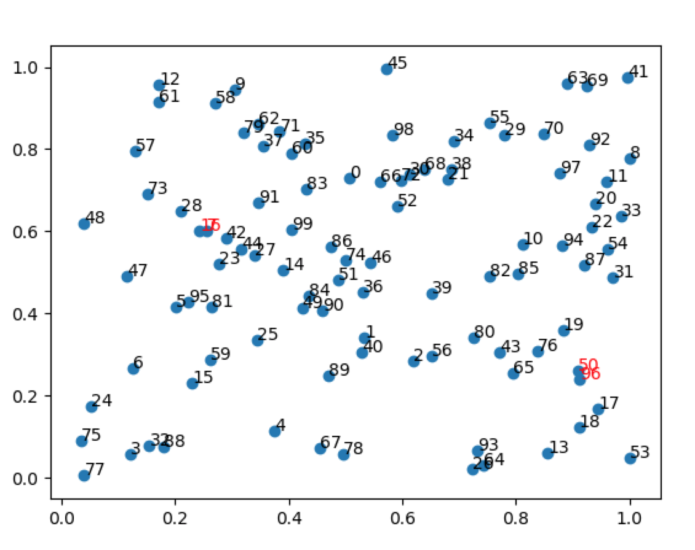

# Closely :triangular_ruler:
 [](https://badge.fury.io/py/closely) [](https://travis-ci.com/justinshenk/closely)


Find the closest pairs in an array. 

Closely uses principal component analysis (PCA) to reduce the dimensions to 2 and a divide and conquer algorithm to find the closest pair of points.

### Getting Started

```bash
pip install closely
```

or install from source:
```bash
git clone https://github.com/justinshenk/closely
cd closely
pip install .
```

### How to use

```python
import closely

# X is an n x m numpy array
pairs, distances = closely.solve(X, n=1)
```

You can specify how many pairs you want to identify with `n`.


### Example
```python
import closely
import numpy as np
import matplotlib.pyplot as plt

# Create dataset
X = np.random.random((100,2))
pairs, distance = closely.solve(X, n=1)

# Plot points
z, y = np.split(X, 2, axis=1)
fig, ax = plt.subplots()
ax.scatter(z, y) 

for i, txt in enumerate(X): 
    if i in pairs: 
        ax.annotate(i, (z[i], y[i]), color='red') 
    else: 
        ax.annotate(i, (z[i], y[i]))

plt.show() 
```

Check pairs:
```ipython
In [10]: pairs                                                                                                                                
Out[10]: 
array([[ 7, 16],
       [96, 50]])

```

Output:



### Caveats
If your data has more than 3 features, `closely` will reduce the dimensionality by projecting it onto two directions that explain most of the variance. This speeds up processing, but is not 100% precise. In other words, if your data has four columns (eg, x, y, z, a), it will apply divide-and-conquer on the new projection bases P1 and P2.

It also removes the first point in a pair if `n`>1. In rare cases this leads to false negatives if the data is highly overlapping.


### Credit and Explanation

Python code modified from [Andriy Lazorenko](https://medium.com/@andriylazorenko/closest-pair-of-points-in-python-79e2409fc0b2), packaged and made useful for >2 features by Justin Shenk.
